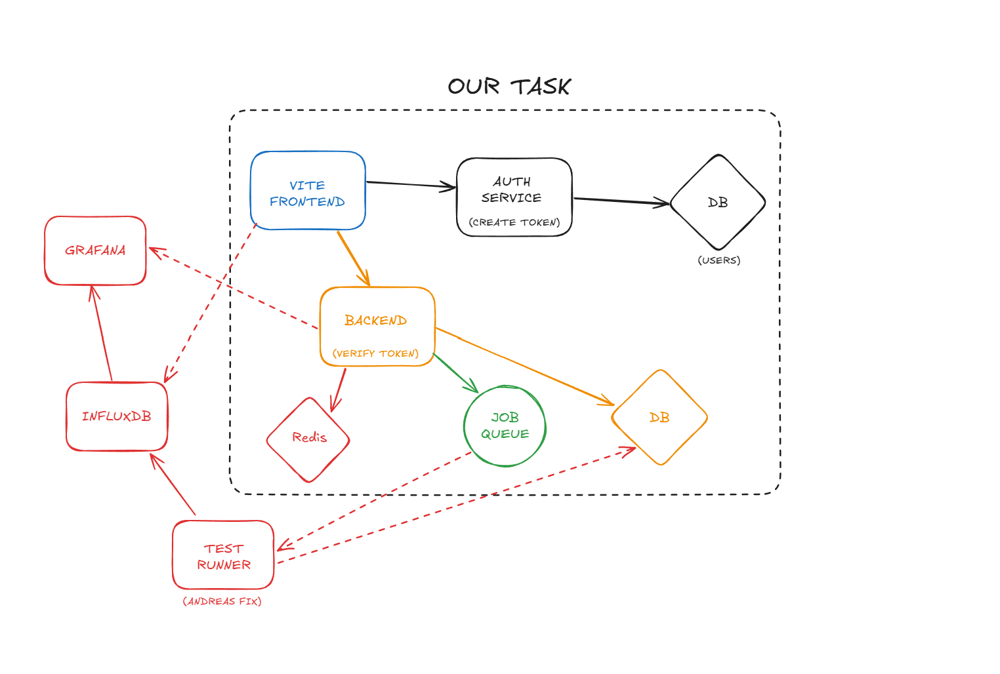

# Architecture

Our task is to create every microservice that are inside of the doted box. Grafana, InfluxDB and Test Runner are already implemented.

## Services

### 1. Auth Service

#### Responsibilities

- Handle user authentication using Better Auth.
- Create and validate tokens (e.g. JWT or session tokens).
- Store user and session information in the user database (and Redis if we use session storage).
- Expose endpoints that the frontend uses for login/logout.

#### Technology

- Node.js-based service using Hono and Better Auth.
- Persists users in a PostgreSQL database.

### 2. Frontend Service

#### Responsibilities

- Provide the user interface for:
  - logging in
  - viewing devices and their status
  - managing test cases and environments
  - creating and inspecting test runs
- Call the backend API for all data and actions.
- Forward the authentication token received from the Auth Service on each request.

#### Technology

- Vite + (Svelte)
- pico.css for styling
- Communicates with backend via JSON over HTTP (REST).

### 3. Backend Service

#### Responsibilities

- Verify tokens on all incoming API requests.
- Provide REST endpoints for:
  - devices (logical view and state)
  - test cases
  - test environments
  - test runs and their results
- Maintain device state (Available / In Test / Offline).
- On “start test run”:
  - validate input
  - mark devices as In Test
  - persist the TestRun in the database
  - send a job to the job queue.
- Expose a callback endpoint that the Test Runner calls when a job finishes, to:
  - store results
  - update TestRun status
  - mark devices as Available again.

#### Technology

- Node.js backend using Hono.
- Communicates with:
  - Database (PostgreSQL)
  - Job queue (RabbitMQ)
  - Auth service (Better Auth)
  - External systems indirectly via the Test Runner.

### 4. Job Queue

#### Responsibilities

- Decouple HTTP requests from long-running test execution.
- Receive test jobs from the backend.
- Deliver jobs to the Test Runner service.

#### Technology

- RabbitMQ.
- Asynchronous communication:
  - Backend → RabbitMQ (publish job)
  - Test Runner → RabbitMQ (consume job)

### 5. Database

#### Responsibilities

- Store application data:
  - devices (logical representation)
  - test cases
  - test environments
  - test runs and results

#### Technology

- PostgreSQL.