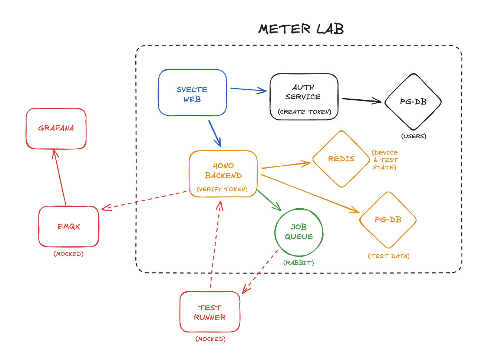

# Architecture

Our task is to create every microservice that are inside of the doted box. Grafana, InfluxDB and Test Runner are already implemented.

## Services

### 1. Auth Service

#### Responsibilities

- Handle user authentication using Better Auth.
- Create authentication tokens (e.g. JWT).
- Persist user and authentication data.
- Provide a **dashboard** for:
  - adding users
  - managing users
  - assigning roles and permissions
- Expose authentication endpoints used by the frontend for login and logout.

> Token validation is handled by the Backend service.

#### Technology

- **Next.js** application.
- Uses **Better Auth** for authentication.
- **Custom-built** admin dashboard.
- Persists users in a **PostgreSQL database (users DB)** using Drizzle ORM.

---

### 2. Frontend (Svelte Web)

#### Responsibilities

- Provide the user interface for:
  - logging in
  - viewing devices and their current state
  - managing test cases and test environments
  - creating and inspecting test runs
- Communicate with the Auth Service for authentication.
- Communicate with the Backend API for all application data and actions.
- Forward the authentication token on each backend request.

#### Technology

- **SvelteKit with Node.js**
- **Shadcn-Svelte** and **Tailwind CSS** for styling
- JSON over HTTP (RPC)

---

### 3. Backend Service

#### Responsibilities

- Verify authentication tokens on all incoming API requests.
- Provide REST & RPC endpoints for:
  - devices (logical representation and state)
  - tests
  - test results
  - creating test
- Maintain device state:
  - Available
  - Under Test
  - Offline
- On **start test run**:
  - validate input
  - update device state to *Under Test*
  - persist test run metadata
  - enqueue a job in the job queue
- Receive callbacks from the Test Runner when a job finishes to:
  - store test results
  - update test run status
  - mark devices as *Available* again
- Interact with EMQX (currently mocked).

#### Technology

- Node.js service using **Hono**.
- Communicates with:
  - **PostgreSQL (test data DB)**
  - **Redis** (device and test state)
  - **RabbitMQ** (job queue)
  - **Auth Service** (token verification)

---

### 4. Job Queue

#### Responsibilities

- Decouple synchronous HTTP requests from long-running test execution.
- Receive test execution jobs from the Backend.
- Deliver jobs to the Test Runner service.

#### Technology

- **RabbitMQ**
- Asynchronous messaging:
  - Backend → RabbitMQ (publish job)
  - Test Runner → RabbitMQ (consume job)

---

### 5. Databases

#### PostgreSQL – Users

- Stores user and authentication-related data.
- Used exclusively by the Auth Service.

#### PostgreSQL – Test Data

- Stores application data:
  - devices
  - tests & their results

---

### 6. Cache

#### Responsibilities

- Store fast-changing state:
  - device state
  - active test state
- Reduce load on the primary database.
- Support real-time status updates.

#### Technology

- **Redis**