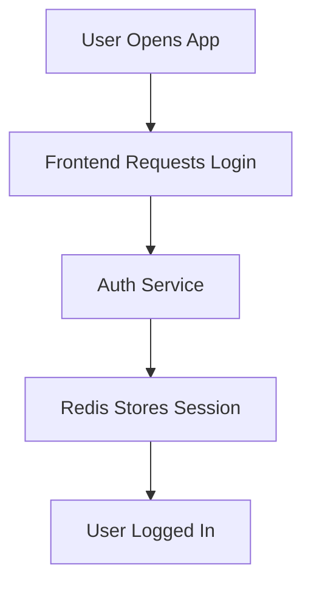
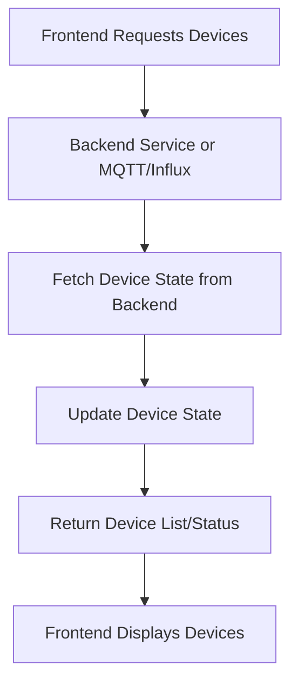
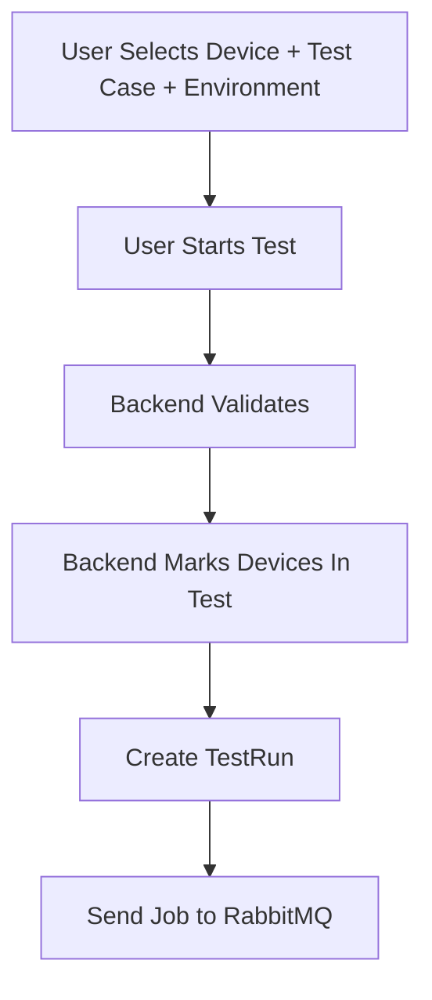
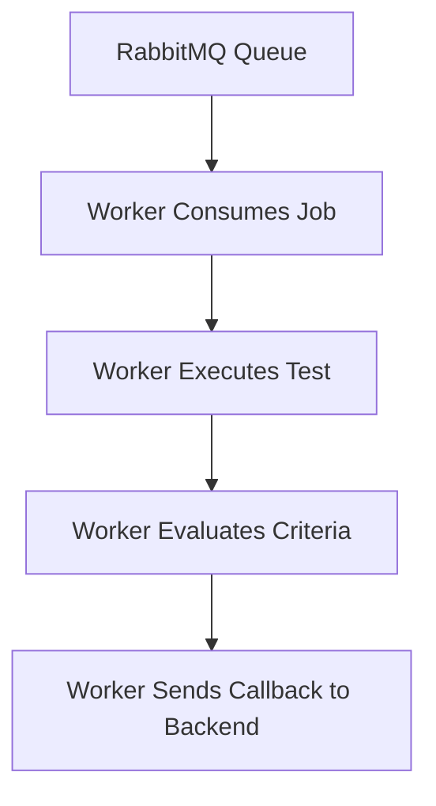
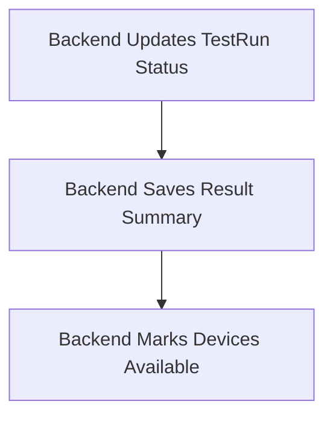
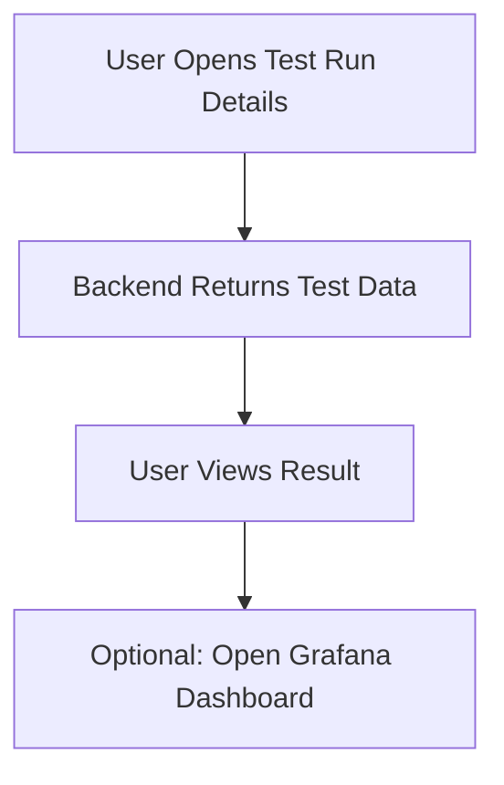

# User Flows

## 1. User logs in

1. User opens the app
2. Frontend redirects to login
3. User logs in via Better Auth
4. Auth Service creates session (stored in Redis)
5. User is redirected to Dashboard

## 2. Devices become visible

1. Frontend requests
2. Backend reads device state from Redis
3. Backend updates device states using:
4. Frontend displays:

- Available devices
- In Test devices
- Offline devices

## 3. User creates a Test Run

1. User selects:

- Device(s)
- Test Case
- Environment

2. User presses Start Test
3. Backend:

- Validates device availability
- Sets device state → `In Test`
- Stores TestRun in DB
- Sends job to RabbitMQ

## 4. Worker Service executes the test

1. Worker receives job from RabbitMQ
2. Worker runs test:

- Polls telemetry from InfluxDB / MQTT

- Monitors metrics

- Evaluates success criteria

3. Worker completes test
4. Worker calls Backend API `/test-runs/:id/callback` with results

## 5. Backend finalizes test

1. Backend:

- Saves results to DB
- Marks device(s) as Available
- Updates TestRun status (Completed, Failed, etc.)

## 6. User views report

1. User opens test run details
2. Backend returns all metadata
3. User can click View in Grafana
4. User analyzes deeper telemetry if needed

